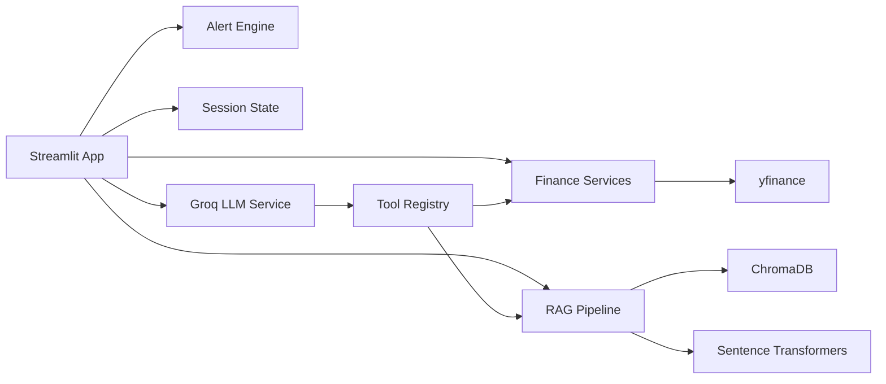

# Finance & Supply Chain Copilot

An AI-powered business intelligence and decision-support platform for finance and supply chain analysis.

This project is built as a production-oriented learning portfolio: simple enough to understand while demonstrating modern AI engineering concepts such as RAG, tool calling, memory, modular services, alerting, deployment, and business-focused product design.

## Problem Statement

Finance and operations teams often need to combine live market data, annual reports, risk disclosures, earnings commentary, and supply chain signals. That information is spread across PDFs, market APIs, filings, and internal notes. This copilot is designed to help users ask grounded business questions and receive structured, source-aware analysis.

Example questions:

- What are the key risks in this annual report?
- What supply chain disruptions are mentioned?
- How has this stock performed recently?
- What financial KPIs should I watch?
- Should I create an alert if the stock drops sharply?

## Business Use Cases

- Equity research support
- Annual report analysis
- Earnings and risk summary generation
- Supplier and logistics risk detection
- Portfolio monitoring
- MBA, consulting, and product strategy case preparation
- AI engineering portfolio demonstration

## Core Features

- Stock lookup and price history using `yfinance`
- Professional Streamlit dashboard shell
- PDF upload design for annual reports and financial documents
- RAG architecture with ChromaDB and sentence-transformers
- Groq-powered LLM service layer
- AI-callable tool registry
- Session memory for selected company, chat history, documents, and alerts
- Alert engine design for price thresholds and future volatility or sentiment alerts
- Supply chain risk analysis module
- Markdown architecture docs with Mermaid diagrams
- Free deployment path with Streamlit Community Cloud

## AI Architecture

The AI system is organized around five ideas:

1. **LLM orchestration**: `src/services/llm_service.py` wraps Groq so the app can generate analysis without tying every module to one vendor.
2. **RAG pipeline**: `src/rag/` is responsible for PDF ingestion, chunking, embeddings, vector search, and grounded answers.
3. **Tool calling**: `src/tools/tool_registry.py` exposes real Python functions the copilot can use for market data, document retrieval, KPI extraction, and alerts.
4. **Memory**: `src/memory/session_state.py` keeps short-term user context during a Streamlit session.
5. **Business modules**: `src/finance/`, `src/supply_chain/`, and `src/alerts/` keep domain logic separate from UI code.

See [docs/ARCHITECTURE.md](docs/ARCHITECTURE.md) for full system diagrams.

## System Design



## RAG Pipeline Explanation

The RAG flow will work like this:

1. User uploads a PDF annual report.
2. The app extracts text from the PDF.
3. Text is split into overlapping chunks.
4. Each chunk is converted into an embedding using a free sentence-transformers model.
5. Chunks and embeddings are stored in local ChromaDB.
6. A user asks a question.
7. The app retrieves the most relevant chunks.
8. Groq receives the question plus source text.
9. The answer is generated with citations.

This reduces hallucination because the model is grounded in retrieved document evidence.

## Tech Stack

| Layer | Tool | Why |
| --- | --- | --- |
| UI | Streamlit | Fast, free, beginner-friendly dashboard framework |
| LLM | Groq API | Free-tier friendly, fast inference |
| RAG | LangChain + ChromaDB | Open-source retrieval architecture |
| Embeddings | sentence-transformers | Free local embeddings |
| Finance data | yfinance | Free stock data for demos |
| Filings | SEC EDGAR APIs | Free public company filings |
| Storage | Local files + optional SQLite | Free and reproducible |
| Deployment | Streamlit Community Cloud | Free portfolio deployment |

## Repository Structure

```text
app/                  Streamlit UI entrypoint
src/services/         LLM and orchestration services
src/rag/              PDF ingestion, chunking, embeddings, retrieval
src/finance/          Market data and finance analysis
src/supply_chain/     Supply chain risk logic
src/memory/           Session and conversation state
src/tools/            Tool-calling registry
src/alerts/           Alert rules and evaluation
src/utils/            Config and logging helpers
configs/              YAML app settings
docs/                 Architecture, deployment, portfolio docs
tests/                Unit tests
data/                 Local vector store, SQLite, and sample data
```

## Installation

```bash
cd finance_supply_chain_copilot
python -m venv .venv
.venv\Scripts\activate
pip install -r requirements.txt
copy .env.example .env
```

Open `.env` and add your free Groq API key:

```text
GROQ_API_KEY=your_groq_api_key_here
```

## Run Locally

```bash
streamlit run app/main.py
```

The app will open in your browser. The first phase already includes a finance dashboard shell with ticker lookup and price history.

## Testing

```bash
pytest
```

## Deployment

This project is designed for Streamlit Community Cloud:

1. Push the repo to GitHub.
2. Create a Streamlit Community Cloud app.
3. Set the entrypoint to `app/main.py`.
4. Add secrets for `GROQ_API_KEY`, `GROQ_MODEL`, and `SEC_USER_AGENT`.

Detailed deployment notes are in [docs/DEPLOYMENT.md](docs/DEPLOYMENT.md).

## Screenshot Placeholders

Add screenshots as the UI matures:

- `docs/screenshots/finance_dashboard.png`
- `docs/screenshots/rag_chat.png`
- `docs/screenshots/supply_chain_risk.png`
- `docs/screenshots/alerts_panel.png`

## Development Roadmap

The project is intentionally built in phases:

1. Folder structure and setup
2. Environment setup
3. Core Streamlit app shell
4. Finance dashboard
5. RAG pipeline
6. Chat system
7. Memory and state
8. Alerts engine
9. Free deployment
10. Refactoring and documentation

See [docs/DEVELOPMENT_PHASES.md](docs/DEVELOPMENT_PHASES.md).

## Future Improvements

- SEC EDGAR filing downloader
- KPI extraction from 10-K and 10-Q reports
- Citation-aware RAG answers
- SQLite persistence for alerts and analysis history
- LangGraph workflow orchestration
- MCP-compatible tool interface
- Docker support
- FastAPI backend
- React frontend
- Evaluation set for retrieval quality and answer faithfulness

## Learning Outcomes

By building this project, you practice:

- Designing modular AI applications
- Explaining RAG and embeddings clearly
- Connecting LLMs to real tools
- Managing application state
- Building free deployable AI demos
- Framing AI systems around business value
- Communicating architecture to recruiters and interviewers

## Resume-Worthy Summary

Built a modular AI-powered Finance and Supply Chain Copilot using Streamlit, Groq, ChromaDB, sentence-transformers, yfinance, and local storage. Designed a RAG architecture for annual report analysis, an extensible tool-calling layer, session memory, stock alerts, and supply chain risk extraction workflows, with documentation and deployment guidance for a production-oriented portfolio.

## Cost Philosophy

The project prioritizes free and open-source tools. It avoids paid infrastructure by default and is designed to run locally or on Streamlit Community Cloud.

## Important Disclaimer

This application is for learning and decision-support demonstrations. It is not financial advice, investment advice, or a replacement for professional analysis.
