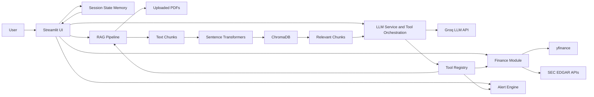
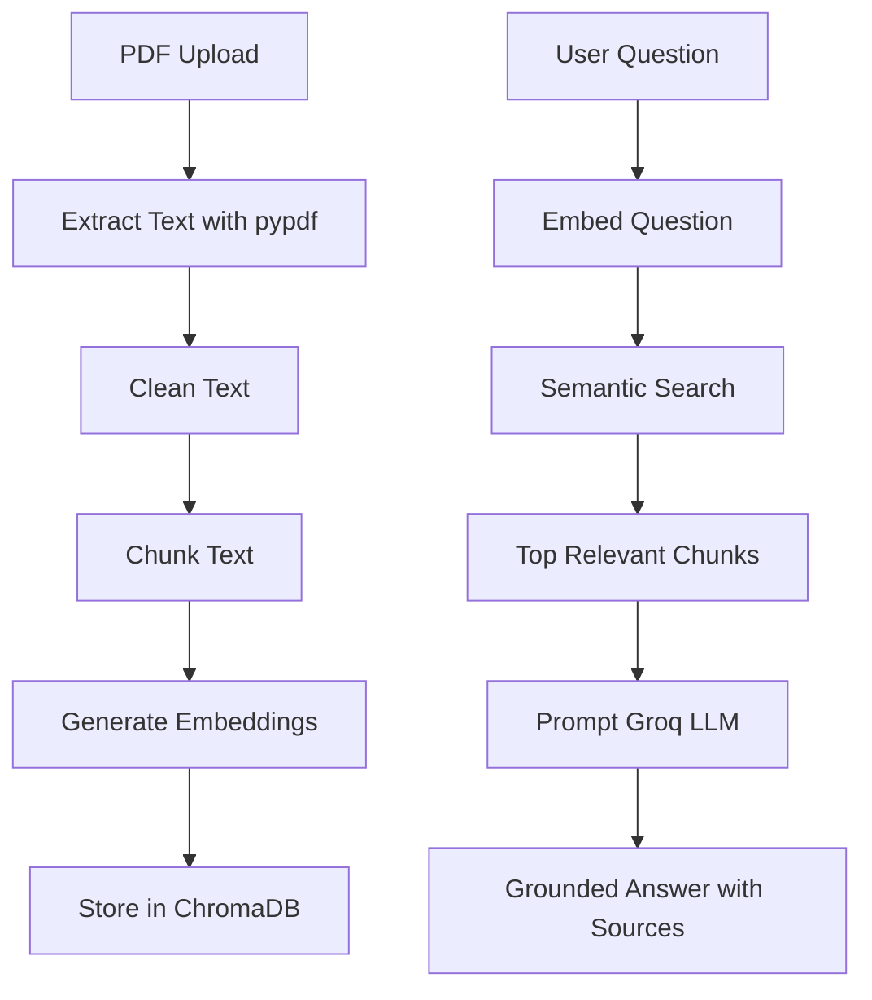
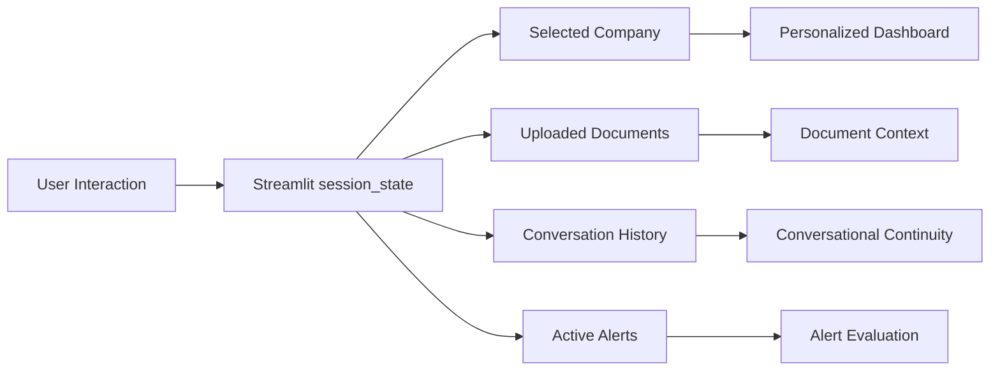
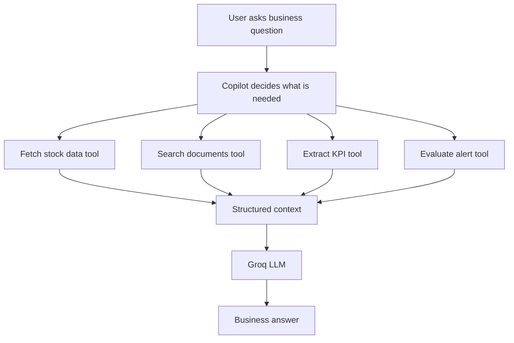

# Architecture

This project is designed as a beginner-friendly but production-oriented AI application. The goal is to make the code easy to learn from while still showing the architectural habits expected in professional systems: separation of concerns, configuration, logging, modular services, and deployability.

## Why This Architecture Exists

The application has five major responsibilities:

1. Show a business dashboard in Streamlit.
2. Fetch finance data from free public sources.
3. Ingest and search financial documents with RAG.
4. Use an LLM to generate grounded business insights.
5. Track user context, alerts, and conversation memory.

Instead of putting all of this into one file, the project separates modules by responsibility. This makes each part easier to understand, test, replace, and extend.

## Folder Structure

```text
finance_supply_chain_copilot/
  app/                 Streamlit entrypoint and UI composition
  src/services/        LLM and orchestration services
  src/rag/             PDF ingestion, chunking, embeddings, retrieval
  src/finance/         yfinance and SEC EDGAR data access
  src/supply_chain/    supply chain risk extraction and prompts
  src/memory/          Streamlit session state and conversation memory
  src/tools/           AI-callable function registry
  src/alerts/          Alert rules and evaluation engine
  src/utils/           Config, logging, shared helpers
  configs/             Non-secret app configuration
  docs/                Architecture and portfolio documentation
  tests/               Unit tests
  data/                Local free storage for vectors, SQLite, samples
```

## System Architecture



## End-to-End Flow

1. The user opens the Streamlit app.
2. `app/main.py` initializes session memory and reads `configs/app_config.yaml`.
3. The user selects a stock ticker. The finance module calls `yfinance`.
4. The UI displays KPI cards and a historical chart.
5. The user uploads annual reports or financial PDFs.
6. The RAG pipeline extracts text, chunks it, embeds it, and stores it in ChromaDB.
7. The user asks a question.
8. The retrieval layer searches ChromaDB for relevant chunks.
9. The LLM receives the question plus retrieved context and produces a grounded answer.
10. The UI shows the answer with citations.
11. The memory module keeps chat history, selected ticker, uploaded documents, and alerts.

## RAG Pipeline



## Chunking Strategy

Documents are split into medium-sized chunks, starting with about 1,000 characters and 150 characters of overlap.

Why:

- Chunks that are too small lose business context.
- Chunks that are too large make retrieval noisy.
- Overlap helps preserve meaning across page and paragraph boundaries.

This is a practical default. Later, the project can add section-aware chunking for 10-K items, risk factors, MD&A, and footnotes.

## Embeddings and Semantic Search

Embeddings convert text into vectors, which are lists of numbers representing meaning. ChromaDB stores those vectors locally for free. When a user asks a question, the app embeds the question and retrieves document chunks with similar meaning.

This reduces hallucination because the LLM is asked to answer from retrieved source text instead of relying only on its general training.

## Memory Flow



Short-term memory is the current Streamlit session: selected company, conversation messages, and uploaded document context. Long-term memory would mean storing useful preferences, alerts, or analysis history in SQLite. This repo starts with short-term memory because it is free and simple, then leaves a clear path to long-term storage.

## Tool Calling Workflow



Tool calling is a design pattern where the AI uses real functions for facts and actions. For example, instead of asking the LLM to guess NVIDIA's latest stock price, the app calls `get_stock_snapshot("NVDA")` and gives that result to the LLM.

## Scaling Path

The project starts simple, but the boundaries are chosen so it can grow:

- Streamlit can later become a React frontend.
- Service modules can later move behind FastAPI.
- Streamlit session memory can later become SQLite, Postgres, or Redis.
- The tool registry can later become LangGraph, CrewAI, or MCP-compatible tools.
- Local ChromaDB can later become a managed vector database if a paid production use case justifies it.

## Tradeoffs

- Streamlit is faster for learning and demos than a separate frontend/backend stack.
- ChromaDB local persistence is free and simple, but not ideal for high-concurrency production.
- Groq is low-cost and fast, but production apps should keep model choice configurable.
- yfinance is excellent for demos and learning, but enterprise finance apps would need licensed market data.
- Session state is beginner-friendly, but persistent memory needs a database.
